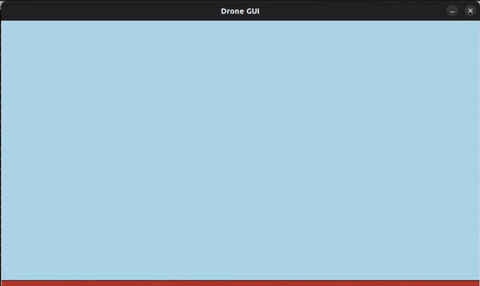

# Workshop-ROS2
In this workshop, you'll gain a thorough understanding of ROS 2 as you develop a 2D controller from the ground up for a quadrotor, mastering fundamental concepts along the way.
<p align = "center">
<a target="_blank"></a
</p>

## Installing ROS 2

Follow the steps on the links below (select the link which corresponds to your operating system):
- [ROS 2 Humble - Ubuntu 22.04LTS](https://docs.ros.org/en/humble/Installation/Ubuntu-Install-Debians.html)
- [ROS 2 Foxy - Ubuntu 20.04LTS](https://docs.ros.org/en/foxy/Installation/Ubuntu-Install-Debians.html)

## Post Installation

1) Open the .bashrc file. This file is read by the terminal every time it starts up, and tells your terminal where the programs and libraries are located.
```
gedit ~/.bashrc
```

2) Tell the .bashrc file where ROS 2 is setup
```
source /opt/ros/humble/setup.bash
source /usr/share/colcon_argcomplete/hook/colcon-argcomplete.bash
source /usr/share/colcon_cd/function/colcon_cd.sh
export _colcon_cd_root=/opt/ros/humble
```

3) To avoid Python warnings, also add the following line to the .bashrc
```
PYTHONWARNINGS="ignore:easy_install command is deprecated,ignore:setup.py install is deprecated"
export PYTHONWARNINGS
```

4) To make your journey more enjoyable, also add the following line. This will be explained during the workshop
```
alias s="source ${HOME}/.bashrc"
```

5) For handling how your ROS 2 data flows on the local network, also add these optional lines
```
export ROS_DOMAIN_ID=0
export ROS_LOCALHOST_ONLY=0
```
You can read more about this here [Domain-ID](https://docs.ros.org/en/humble/Concepts/About-Domain-ID.html).

## Preparing a workspace to write code

In order to create a workspace/directory where your code will be stored, follow the steps:

1) Create the workspace
```
mkdir drone_ws
```

2) Create the src directory where the code will be placed
```
cd drone_ws
mkdir src
```
3) Clone this repository inside the src directory
```
cd src
git clone https://github.com/PegasusResearch/Workshop-ROS2.git
```
4) Compile/Index the code
```
cd ..
colcon build --symlink-install
```

5) Add the following line to your .bashrc file
```
source ${HOME}/drone_ws/install/setup.bash
```

6) Close this terminal. Open a new one and test it!
```
ros2 launch drone_simulation simulation.launch.py
```
